# DIU24
Prácticas Diseño Interfaces de Usuario 2023-24 (Tema: .... ) 

Grupo: DIU3_MotrilCF.  Curso: 2023/24 
Updated: 23/3/2024

Proyecto: 
WeBoard

Descripción: 

Una página web que permite a usuarios conectar con otros jugadores de juegos de mesa y hacer quedadas para poder jugar y competir en sus juegos de mesa favoritos.

Logotipo: 

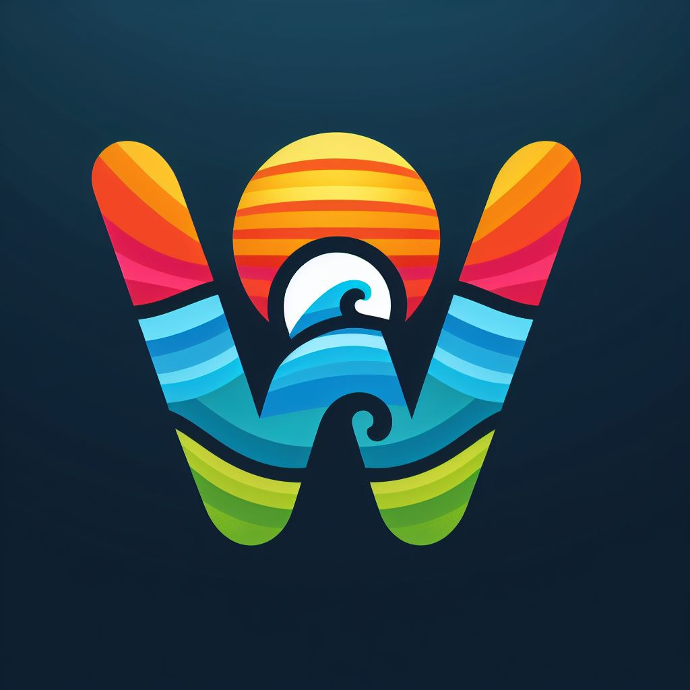

Miembros
 * :bust_in_silhouette:   Victor Mojica González    :octocat:     
 * :bust_in_silhouette:   Alejandro Ramos Peña      :octocat:

----- 

# Proceso de Diseño 

## Paso 1. UX User & Desk Research & Analisis 

 **1.a User Reseach Plan**

El proyecto Granaventour busca ofrecer actividades al aire libre en la región de Granada. El objetivo del plan de investigación es evaluar la proximidad del usuario y la usabilidad de la aplicación, así como identificar posibles desafíos y comodidades que los usuarios encuentren al utilizarla. Los objetivos de negocio incluyen la reducción del impacto del COVID-19 en el turismo local y garantizar la seguridad en todas las actividades. Los criterios de éxito del estudio abarcan la recopilación de información cualitativa y cuantitativa de los usuarios, la creación de documentos como perfiles de usuario ficticios y la toma de decisiones basada en los hallazgos del estudio. Los métodos de investigación primaria incluyen etnografía, entrevistas de usuario, investigación contextual, pruebas de usabilidad y encuestas posteriores a la sesión. Se enfocará en temas como la duración y el precio de las actividades, así como en la utilidad, facilidad de aprendizaje, memorabilidad, errores y satisfacción del diseño. La selección de participantes se orientará hacia jóvenes, entusiastas del deporte y amantes de la aventura.  

 1.b Competitive Analysis

[Competitive Analisis](<P1/Desk research.pdf>) Después de un analisis exhaustivo de algunas empresas que ofrecen actividades deportivas en la naturaleza tanto en Granada como de fuera, hemos llegado a la conclusión de que GranaVentour no es una buena opción para disfrutar de una de sus actividades. Esto se debe principalmente a la falta de información y errores que hay en su página. Ademas de la dificultad que hay para contactar con ellos. En este analisis competitivo se han comparado Nevadensis y GuiasBoira y por muy poco la mejor opcion es Nevadensis. Nevadenis a diferencia de GranaVentour ofrece una pagina web atractiva y responsive con una gran variedad de actividades, para contactar con ellos es muy fácil y rápido. Tanto Nevandendis como Guias Boira disponen de mucha informacion sobre sus actividades (temporada verano/invierno), sin embargo Guias Boira tiene una mejor distinción de niveles. A pesar de esto Nevadensis es la mejor opción ya que tiene una gran galería de fotografias en alta definición y una barra de búsqueda que no tienen ni GranaVentour ni Guias Boira que hace que usuario pueda buscar la actividad segun sus necesidades. Ante cualquier duda siempre estan activos en redes sociales, en cambio Granaventour tiene su ultima publicación hace 6 años.

 1.c Persona
Guillermo ha sido seleccionado porque tiene  una hija que le gusta mucho hacer excurisones por la montña, admemás vive en Málaga y le gusta mucho visitar Granada siempre que puede.

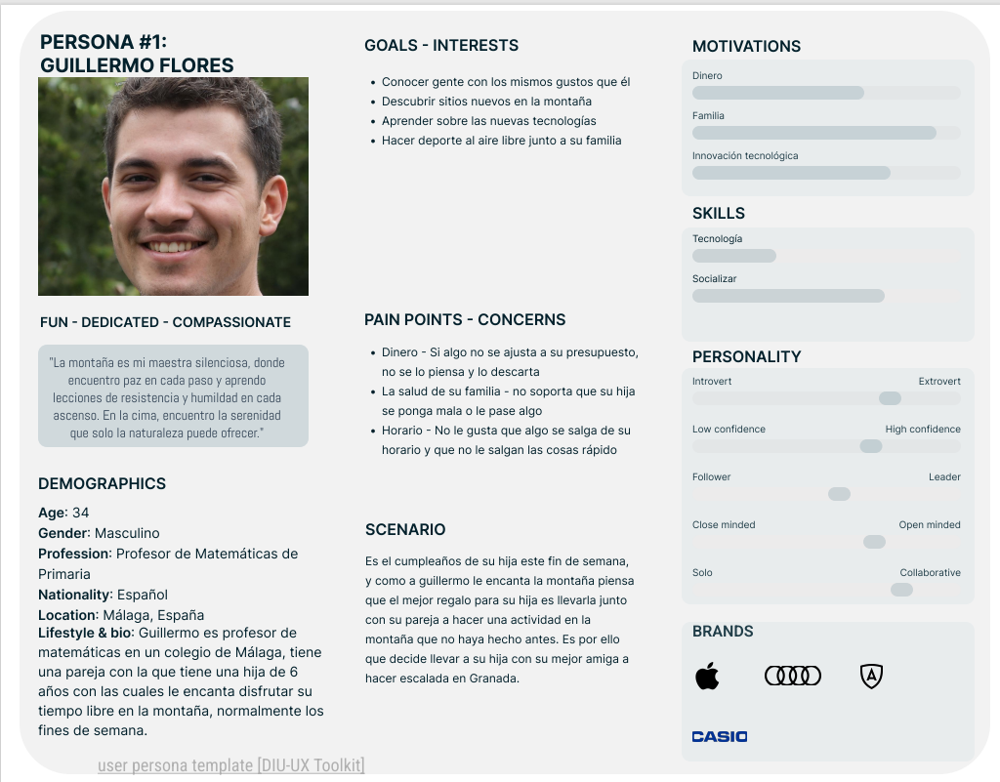

Hemos seleccionado a Leticia Brown porque es una mujer aventurera amante del deporte y de la naturaleza, además de esto vivió en Granada durante 9 meses y conoce la ciudad y algo del idioma.

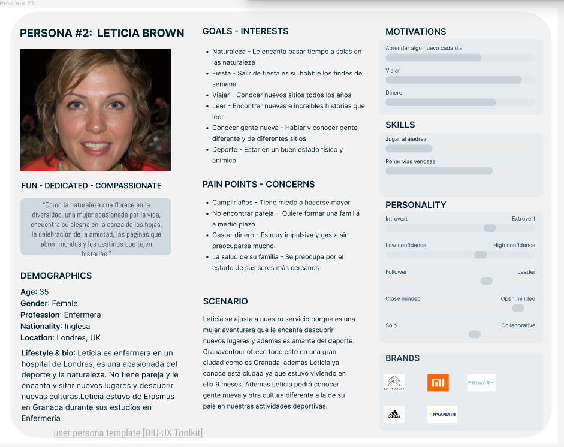

 1.d User Journey Map

[Journey Map Guillermo](img/1c_JourneyMap1.png) Guillermo como ha hecho alguna otra vez, quiere hacer una reserva para ir con su hija y a su mejor amiga a una actividad de escalada. Alguna vez ha reservado en la 
página pero nunca ha hecho de escalada y se atreve por primera vez ya que a su hija le hace mucha ilusión.

[Journey Map Leticia](img/1c_JourneyMap2.png) Leticia vuelve a Granada a recordar sus viejos tiempos en la ciudad que estuvo de erasmus 9 meses y decide encontrar una actividad para pasar un tiempo en la naturaleza y hacer deporte a la misma vez. Leticia encontró por internet la pagina de Granaventour y reservo una actividad de senderismo.

 1.e Usability Review
----
- Enlace al documento:  [Usability Review](<P1/Usability-review-Granaventour.xlsx - Usability scores.pdf>) 
- Valoración final (numérica): 45 POOR
- Comentario sobre la valoración: Granaventour deja mucho que desear como página de actividades, no resuelve nada al cliente, falta mucha información y al final tienes que terminar llamando para informarte y realizar la reserva. Además no tienen las redes sociales activas y la página web no llama nada la atencion a los posibles clientes. Con la mejora de la página web, incluison de funciones como barra de busqueda, inserccion de videos o la posibilidad de reserva online podria mejorar exponencialmente. Como conclusión Granaventour tiene una propuesta con mucho potencial pero no está nada aprovechada y hace que mucha gente busque otras altyernativas como Nevadensis (estudiada anteriormente)

## Paso 2. UX Design  

 2.a Reframing / IDEACION: Feedback Capture Grid / EMpathy map 
----

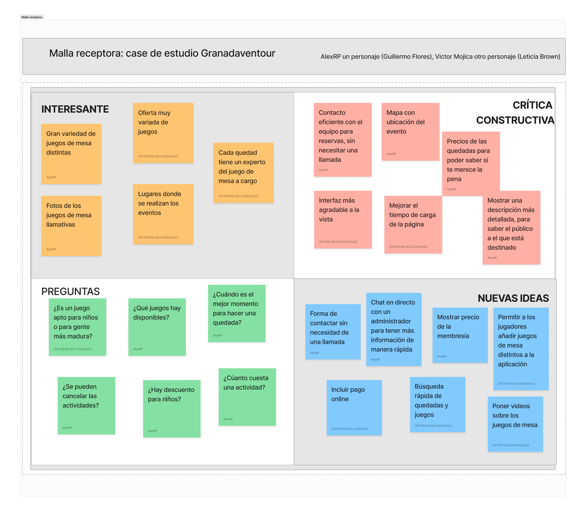
    
>>> ¿Que planteas como "propuesta de valor" para un nuevo diseño de aplicación para economia colaborativa ?
Vimos un problema para los jugadores de juegos de mesa los cuales quieren jugar muy a menudo. Normalmente tienen que quedar con sus amigos y no siempre pueden estar disponibles entre ellos para jugar muy a menudo, por lo que pensamos que una solución a esto sería crear una plataforma que permitiera a estos jugadores hacer quedadas con otros jugadores desconocidos para jugar juntos. De esta manera, creamos comunidades de jugadores que pueden jugar más habitualmente y les permite disfrutar más aún de sus juegos y conocer gente nueva con sus mismos gustos.

 2.b ScopeCanvas
----

>>> Propuesta de valor 

 2.b User Flow (task) analysis 
-----
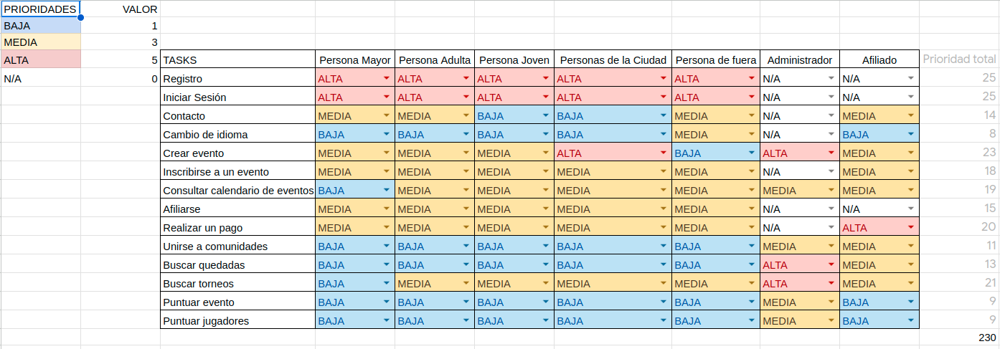
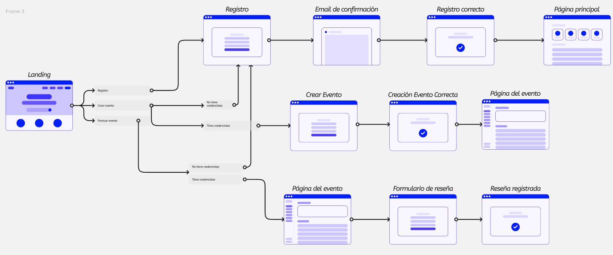
>>> Definir "User Map" y "Task Flow" ... 

 2.c IA: Sitemap + Labelling 
----
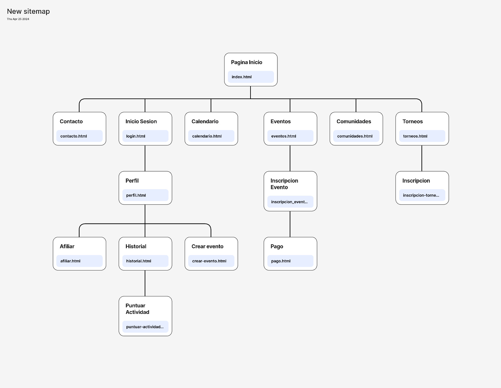
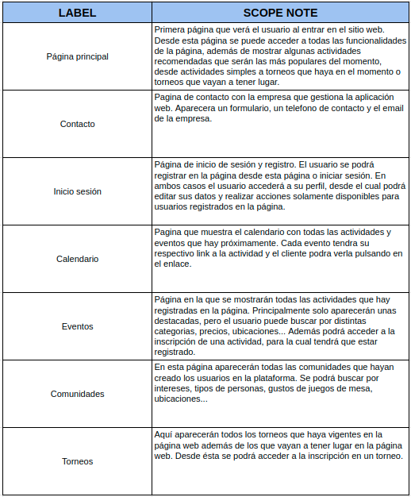

>>> Identificar términos para diálogo con usuario  

Término | Significado     
| ------------- | -------
  Login¿?  | acceder a plataforma

 2.d Wireframes
-----
### Vista para pc
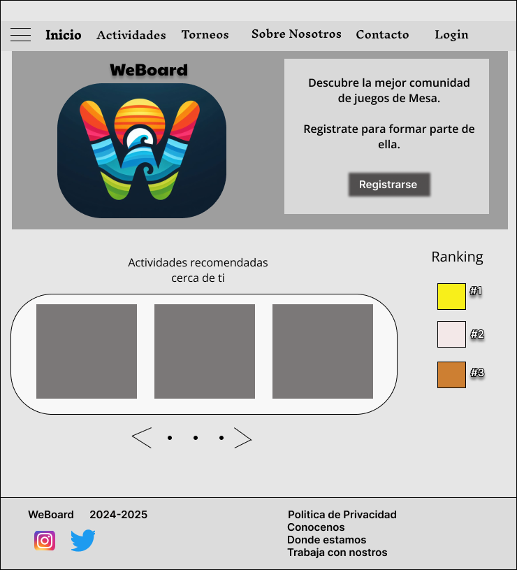

### Vista para móvil
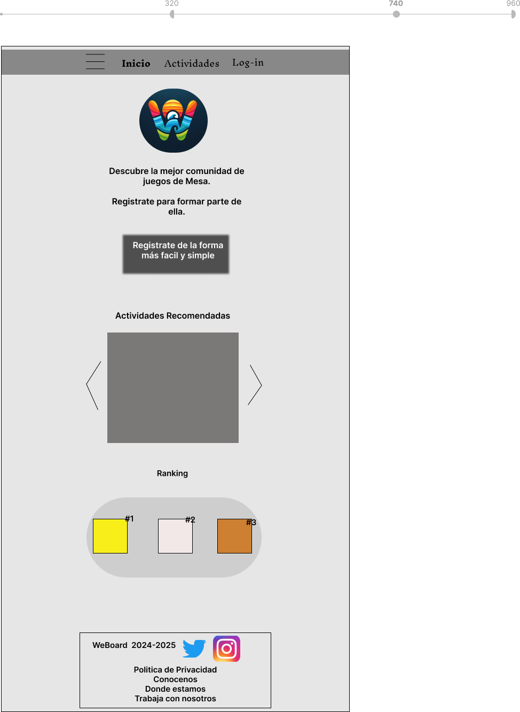

## Paso 3. Mi UX-Case Study (diseño)

 3.a Moodboard
-----
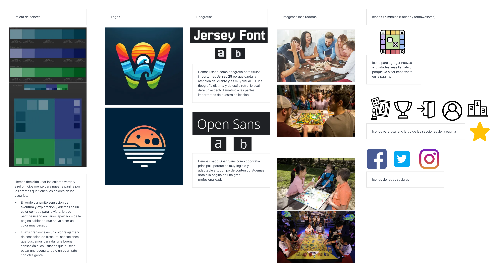

>>> Plantear Diseño visual con una guía de estilos visual (moodboard) 
>>> Incluir Logotipo
>>> Si diseña un logotipo, explique la herramienta utilizada y la resolución empleada. ¿Puede usar esta imagen como cabecera de Twitter, por ejemplo, o necesita otra?

  3.b Landing Page
----

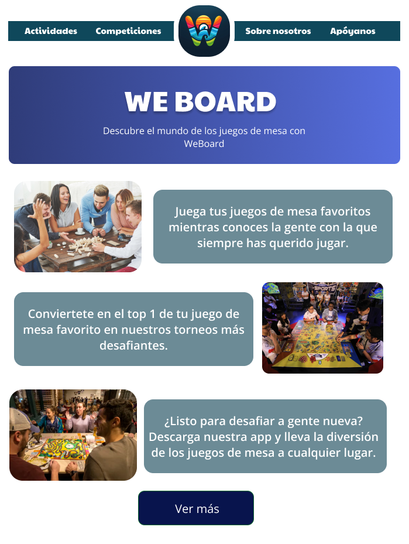

>>> Plantear Landing Page 

 3.c Guidelines
----
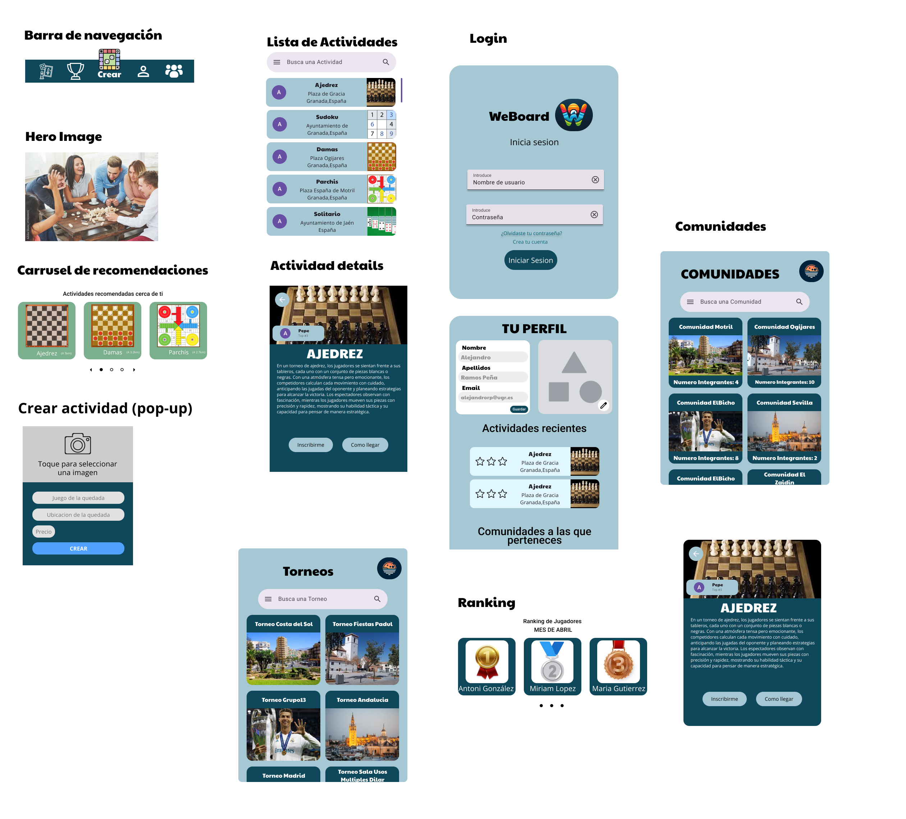
>>> Estudio de Guidelines y Patrones IU a usar 
>>> Tras documentarse, muestre las deciones tomadas sobre Patrones IU a usar para la fase siguiente de prototipado.
Para los patrones de nuestra aplicación hemos hecho uso de los componentes que nos ofrece material design, pues nos ha facilitado el integrar los distintos patrones de diseño en nuestra aplicación.
Además del uso de material design para elementos como son las tarjetas, la introduccion de datos tanto en búsqueda como login y demás hemos creado algunos nosotros mismos como pueden ser la barra de navegación la cual quisimos que contara con un elemento destacado que es el de crear una publicación y los modales que usamos para mostrar la información sobre eventos, competiciones, comunidades...

  3.d Mockup
A continuacion de muestran las partes más importantes del Mockup
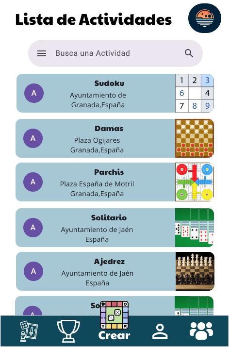

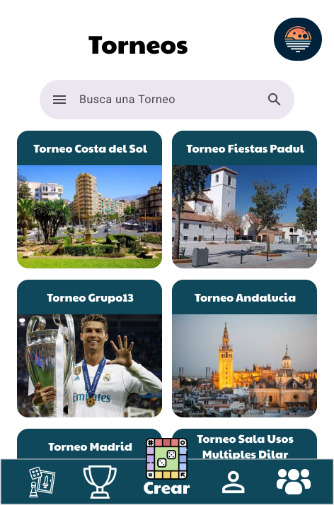
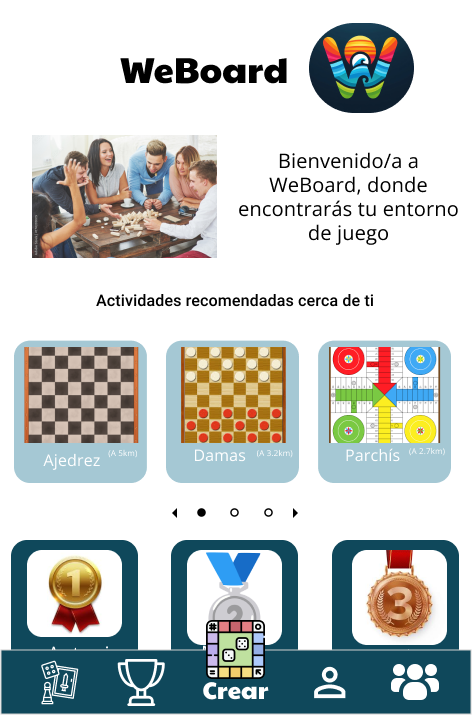

 3.e ¿My UX-Case Study?
Se ha publicado el archivo figma en el repositorio de DIU  de figma y un resumen en las partes posteriores de README

## Paso 5. Exportación & evaluación con Eye Tracking 

)  5.b Eye Tracking method 

>>> Indica cómo diseñas experimento y reclutas usuarios (uso de gazerecorder.com)  

Diseño del experimento 
----

>> Uso de imágenes (preferentemente) -> hay que esablecer una duración de visualización y  
>> fijar las áreas de interes (AoI) antes del diseño. Planificar qué tarea debe hacer el usuario (buscar, comprar...) 

  
>> cambiar img por tu diseño de experimento  

>> Recordar que gazerecorder es una versión de pruebas: usar sólo con 3 usuarios para generar mapa de calor (recordar que crédito > 0 para que funcione) 

Resultados y valoración 
-----

>> Cambiar por tus resultados
  

## Paso 4. Evaluación 

 4.a Caso asignado
Se nos ha asignado analizar la aplicacion de DIU1-loqueteapetezca, que trata sobre juegos de mesa, como nuestra aplicación. El enlace al repositorio es: (https://github.com/DIU1-loqueteapetezca/DIU)
 4.b User Testing
----
Para esta parte se han seleccionado 4 usuarios reales para el caso A y B:
Para el caso A se han seleccionado:
    -User1: Mujer de 23 años de edad que trabaja de higienista y con alguna experiencia con tecnologías.Usa el móvil y el portátil casi a diario, aunque le cuesta encontrar las cosas a veces en las páginas.
    -User2: Hombre de 20 años que trabaja de peluquero, su formacion con tecnologias es básica. No usa dispositivos electronicos excepto el movil. Le cuesta encontrar las cosas.
Para el caso B se han seleccionado:
    -User3: Hombe de 42 años, padre de familia que se dedica a la fotografia. Sabe utlizar las tecnologias más básicas que invlucran su trabajo.
    -User4: Hombre de 24 años, estudiante ingenieria indormatica y con amplios conocimientos avanzados en el mundo de la tecnología.

 

| Usuarios | Sexo/Edad     | Ocupación   |  Exp.TIC    | Personalidad | Plataforma | TestA/B
| ------------- | -------- | ----------- | ----------- | -----------  | ---------- | ----
| Sara          | M / 23   | Higienista  | Media       | Introvertida | móvil      | A 
| Angel         | H / 20   | Peluqeuro   | Baja        | Extrovertido | móvil      | A 
| Carlos        | H / 42   | Fotografo   | Basica      | Emocional    | móvil      | B 
| Gonzalo       | H / 18   | Estudiante  | Avanzada    | Racional     | móvil      | B 

 4.c Cuestionario SUS
----

>>> Usaremos el **Cuestionario SUS** para valorar la satisfacción de cada usuario con el diseño (A/B) realizado. Para ello usamos la [hoja de cálculo](https://github.com/mgea/DIU19/blob/master/Cuestionario%20SUS%20DIU.xlsx) para calcular resultados sigiendo las pautas para usar la escala SUS e interpretar los resultados
http://usabilitygeek.com/how-to-use-the-system-usability-scale-sus-to-evaluate-the-usability-of-your-website/)
Para más información, consultar aquí sobre la [metodología SUS](https://cui.unige.ch/isi/icle-wiki/_media/ipm:test-suschapt.pdf)

>>> Adjuntar captura de imagen con los resultados + Valoración personal 

 4.d Usability Report
----

>> Añadir report de usabilidad para práctica B (la de los compañeros)

>>> Valoración personal 

5.) Conclusion de EVALUACION (A/B testing + usability report + eye tracking) 
----

>> recupera el usability report de tu práctica (que es el caso B de los asignados a otros grupos) 
>> con los resultados del A/B testing, de eye tracking y del usability report:
>>  comentad en 2-3 parrafos cual es la conclusion acerca de la realización de la práctica y su evaluación con esas técnicas y que habéis aprendido

## Conclusión final / Valoración de las prácticas

>>> (90-150 palabras) Opinión FINAL del proceso de desarrollo de diseño siguiendo metodología UX y valoración (positiva /negativa) de los resultados obtenidos  

